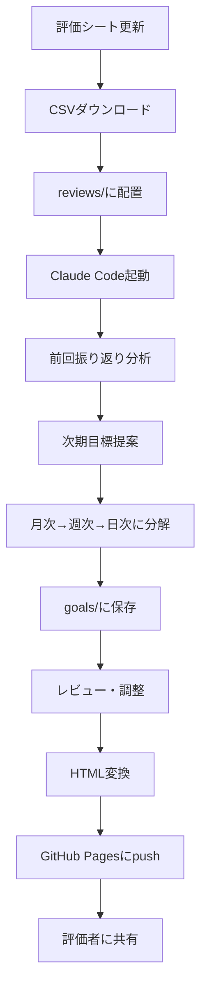
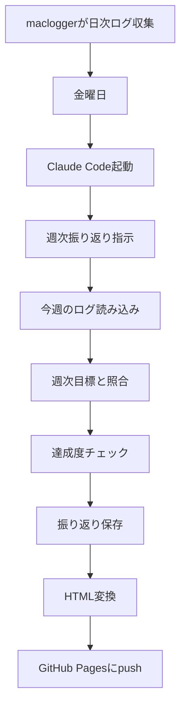
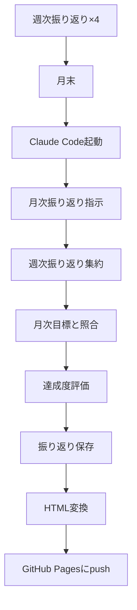
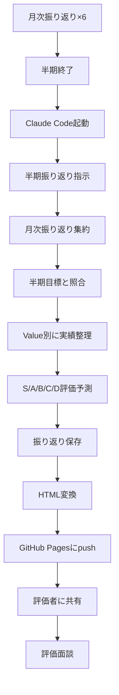

# xincere-review システム仕様書

## 概要

**xincere-review**は、人事評価プロセスを半自動化するシステムです。目標設定から日々の振り返り、半期評価まで、Claude CodeとmacloggerとGitHub Pagesを組み合わせて、評価者が確認しやすい形で記録を残します。

## システム構成

### コンポーネント

```
xincere-review/           # メインプロジェクト
├── .claude/
│   └── skills/
│       ├── goal-management/   # 評価支援skill
│       └── ogawa-profile/         # ユーザープロフィールskill
├── reviews/
│   ├── YYYY-HX-前回評価.csv      # 評価シート（スプシからDL）
│   ├── YYYY-HX-振り返り.md        # 半期振り返り
│   ├── monthly/
│   │   └── YYYY-MM.md            # 月次振り返り
│   └── weekly/
│       └── YYYY-MM-WW.md         # 週次振り返り
├── goals/
│   ├── YYYY-HX-半期目標.md       # 半期目標
│   ├── YYYY-HX-月次目標.md       # 月次目標（6ヶ月分）
│   ├── YYYY-MM-週次目標.md       # 週次目標（4週分）
│   └── YYYY-MM-WW-日次目標.md    # 日次目標（5日分）
├── logs/ -> ../maclogger/reports/  # シンボリックリンク
│   ├── daily/
│   │   └── YYYY-MM-DD.md         # 日次ログ（maclogger自動収集）
│   └── weekly/
│       └── YYYY-MM-WW.md         # 週次ログ（maclogger自動収集）
├── docs/                          # GitHub Pages公開用
│   ├── index.html                # ダッシュボード
│   ├── goals/
│   │   └── YYYY-HX.html          # 半期目標（HTML）
│   ├── reviews/
│   │   ├── YYYY-HX.html          # 半期振り返り（HTML）
│   │   ├── monthly/
│   │   │   └── YYYY-MM.html
│   │   └── weekly/
│   │       └── YYYY-MM-WW.html
│   └── assets/
│       └── style.css
└── scripts/
    ├── generate_html.py          # Markdown → HTML変換
    └── deploy.sh                 # GitHub Pagesデプロイ
```

### 連携システム

**maclogger** (別プロジェクト)
- 日次・週次のログを自動収集
- xincere-reviewからシンボリックリンクで参照

**GitHub Pages**
- 評価記録を公開
- 評価者がブラウザで閲覧可能

**Google Spreadsheet**
- 会社の評価シート管理
- CSV形式でエクスポート可能

---

## 運用フロー

### 【半期運用】評価終了後（年2回）

#### タイミング
- FY上半期終了後（2月末）
- FY下半期終了後（8月末）

#### フロー



#### 実行コマンド

```bash
# 1. 評価シートをダウンロード
# Google SpreadsheetからCSVエクスポート
# → reviews/2025-H2-前回評価.csv に保存

# 2. Claude Code起動
cd ~/xincere-review
claude

# 3. 目標設定を指示
> 前回の振り返り（reviews/2025-H2-前回評価.csv）を見て、次期（2026-H1）の目標を立てて

# Claude Codeが実行:
# - 前回評価の分析
# - 課題の抽出
# - 次期の半期目標提案（Be hungry / Be an owner / Be sustainable）
# - 月次目標に分解（6ヶ月分）
# - 週次目標に分解（直近1ヶ月の4週分）
# - 日次目標に分解（直近1週間の5日分）
# - goals/に保存

# 4. 生成された目標をレビュー
cat goals/2026-H1-半期目標.md
cat goals/2026-H1-月次目標.md
# ...

# 5. 調整が必要な場合
> 「Be hungry」の目標を週1本のペースに調整して

# 6. HTML変換
python scripts/generate_html.py

# 7. GitHub Pagesにデプロイ
./scripts/deploy.sh

# 8. 評価者に共有
# https://ogawa.github.io/xincere-review/goals/2026-H1.html
```

#### 成果物

- `goals/2026-H1-半期目標.md`
- `goals/2026-H1-月次目標.md`
- `goals/2026-03-週次目標.md`（直近1ヶ月）
- `goals/2026-03-W1-日次目標.md`（直近1週）
- `docs/goals/2026-H1.html`（公開用）

---

### 【週次運用】毎週金曜日

#### タイミング
- 毎週金曜日 17:00〜18:00

#### フロー



#### 実行コマンド

```bash
# 1. Claude Code起動
cd ~/xincere-review
claude

# 2. 週次振り返りを指示
> 今週（12/23-12/29）の週次振り返りをして

# Claude Codeが実行:
# - logs/daily/2025-12-23.md 〜 2025-12-29.md を読み込み
# - goals/2025-12-W52-日次目標.md と照合
# - 達成度をチェック
#   - ✅ [x] Slack Tips投稿（12/25完了）
#   - ❌ [ ] Confluence記事執筆（未完了）
# - reviews/weekly/2025-12-W52.md に保存

# 3. 生成された振り返りをレビュー
cat reviews/weekly/2025-12-W52.md

# 4. HTML変換
python scripts/generate_html.py

# 5. GitHub Pagesにデプロイ
./scripts/deploy.sh
```

#### 成果物

- `reviews/weekly/2025-12-W52.md`
- `docs/reviews/weekly/2025-12-W52.html`

#### タスクチェック形式

```markdown
# 2025年12月 Week 52 振り返り

## 週次目標の達成状況

### Be hungry
- ✅ [x] Slack技術Tips投稿（12/25完了）
  - 投稿内容: Next.jsのパフォーマンス計測
- ❌ [ ] Confluence記事執筆（未完了）
  - 理由: atoyoro開発を優先
  - 対策: 来週前半に執筆

### Be an owner
- ✅ [x] 週次レポート投稿（12/27完了）
- ✅ [x] 事業部長との定期相談（12/26実施）

### Be sustainable
- ⚠️ [~] maclogger改善（一部完了）
  - 完了: ログ形式の修正
  - 未完了: エラーハンドリング
```

---

### 【月次運用】毎月末

#### タイミング
- 毎月最終金曜日

#### フロー



#### 実行コマンド

```bash
# 1. Claude Code起動
cd ~/xincere-review
claude

# 2. 月次振り返りを指示
> 今月（2026年1月）の月次振り返りをして

# Claude Codeが実行:
# - reviews/weekly/2026-01-W*.md を読み込み（4週分）
# - goals/2026-H1-月次目標.md と照合
# - 達成度を評価
# - reviews/monthly/2026-01.md に保存

# 3. HTML変換 & デプロイ
python scripts/generate_html.py
./scripts/deploy.sh
```

#### 成果物

- `reviews/monthly/2026-01.md`
- `docs/reviews/monthly/2026-01.html`

---

### 【半期振り返り】評価期間終了時（年2回）

#### タイミング
- FY上半期終了時（2月末）
- FY下半期終了時（8月末）

#### フロー



#### 実行コマンド

```bash
# 1. Claude Code起動
cd ~/xincere-review
claude

# 2. 半期振り返りを指示
> 今期（2025-H2: 2025/09〜2026/02）の半期振り返りをして

# Claude Codeが実行:
# - reviews/monthly/2025-09.md 〜 2026-02.md を読み込み（6ヶ月分）
# - goals/2025-H2-半期目標.md と照合
# - Value別に実績を整理
#   - Be hungry: 達成した学習、アウトプット
#   - Be an owner: チーム貢献、発信実績
#   - Be sustainable: 仕組み化、ドキュメント化
# - S/A/B/C/D の評価を予測
# - reviews/2025-H2-振り返り.md に保存

# 3. HTML変換 & デプロイ
python scripts/generate_html.py
./scripts/deploy.sh

# 4. 評価者に共有
# https://ogawa.github.io/xincere-review/reviews/2025-H2.html
```

#### 成果物

- `reviews/2025-H2-振り返り.md`
- `docs/reviews/2025-H2.html`

#### 振り返り構成

```markdown
# FY2025下半期 振り返り

## 能力評価

### G2レベル
- 達成状況: ...
- 具体的なエピソード: ...

### G3レベル
- 達成状況: ...
- 具体的なエピソード: ...

## バリュー評価

### Be hungry（貪欲になれ）
**目標**:
- Confluence技術記事: 12本
- Slack技術Tips: 24本
- CodeRabbit導入

**実績**:
- ✅ Confluence技術記事: 12本達成
  - [記事一覧のリンク]
- ✅ Slack技術Tips: 24本達成
  - [投稿履歴のリンク]
- ✅ CodeRabbit導入完了
  - [活用レポート]

**評価予測**: A

### Be an owner（当事者たれ）
**目標**:
- Slack週次レポート: 24回
- 技術連携MTG: 6回
- 技術選定ドキュメント: 3本

**実績**:
- ✅ Slack週次レポート: 24回達成
- ✅ 技術連携MTG: 6回実施
- ✅ 技術選定ドキュメント: 3本作成

**評価予測**: A

### Be sustainable（継続的であれ）
**目標**:
- 開発ドキュメント: 4本
- テンプレートリポジトリ: 1つ
- 実験的ツール: 2つ
- GitHub Pages公開

**実績**:
- ✅ 開発ドキュメント: 4本作成
  - atoyoro開発ドキュメント
  - Next.js + Vercelベストプラクティス
  - Playwright E2Eテストガイド
  - PR運用ノウハウ
- ✅ テンプレートリポジトリ: 1つ作成
- ✅ 実験的ツール: 2つ開発
  - maclogger（運用中）
  - xincere-review（運用中）
- ✅ GitHub Pages公開

**評価予測**: A

## 総合評価予測

**能力**: G3レベル到達
**Value**: 全A評価
**総合**: A評価

## 根拠

- 全ての成果指標を達成
- アウトプット・発信が習慣化
- チーム貢献が可視化
- 仕組み化により社内全体の生産性向上に貢献
```

---

## GitHub Pages構成

### ディレクトリ構造

```
docs/
├── index.html              # ダッシュボード
├── goals/
│   ├── 2025-H2.html
│   └── 2026-H1.html
├── reviews/
│   ├── 2025-H2.html
│   ├── 2026-H1.html
│   ├── monthly/
│   │   ├── 2025-09.html
│   │   ├── 2025-10.html
│   │   └── ...
│   └── weekly/
│       ├── 2025-09-W1.html
│       ├── 2025-09-W2.html
│       └── ...
└── assets/
    ├── style.css
    └── chart.js
```

### ダッシュボード（index.html）

```html
<!DOCTYPE html>
<html>
<head>
    <title>小川一季 評価記録</title>
    <link rel="stylesheet" href="assets/style.css">
</head>
<body>
    <header>
        <h1>小川一季 評価記録ダッシュボード</h1>
    </header>

    <main>
        <section class="current-period">
            <h2>📊 FY2025下半期（2025/09〜2026/02）</h2>
            <div class="links">
                <a href="goals/2025-H2.html">半期目標</a>
                <a href="reviews/2025-H2.html">半期振り返り</a>
            </div>
            
            <h3>月次振り返り</h3>
            <ul>
                <li><a href="reviews/monthly/2025-09.html">2025年9月</a></li>
                <li><a href="reviews/monthly/2025-10.html">2025年10月</a></li>
                <li><a href="reviews/monthly/2025-11.html">2025年11月</a></li>
                <li><a href="reviews/monthly/2025-12.html">2025年12月</a></li>
                <li><a href="reviews/monthly/2026-01.html">2026年1月</a></li>
                <li><a href="reviews/monthly/2026-02.html">2026年2月</a></li>
            </ul>
        </section>

        <section class="statistics">
            <h2>📈 統計</h2>
            <div class="stats-grid">
                <div class="stat-card">
                    <h3>Confluence投稿</h3>
                    <p class="number">12本</p>
                    <p class="target">目標: 12本</p>
                </div>
                <div class="stat-card">
                    <h3>Slack投稿</h3>
                    <p class="number">24本</p>
                    <p class="target">目標: 24本</p>
                </div>
                <div class="stat-card">
                    <h3>PR数</h3>
                    <p class="number">87件</p>
                </div>
                <div class="stat-card">
                    <h3>コミット数</h3>
                    <p class="number">342件</p>
                </div>
            </div>
        </section>

        <section class="archive">
            <h2>🗂️ アーカイブ</h2>
            <ul>
                <li><a href="reviews/2025-H1.html">FY2025上半期</a></li>
                <li><a href="reviews/2024-H2.html">FY2024下半期</a></li>
            </ul>
        </section>

        <section class="links">
            <h2>🔗 関連リンク</h2>
            <ul>
                <li><a href="https://github.com/ogawa/projects">GitHub</a></li>
                <li><a href="https://confluence.company.com/ogawa">Confluence</a></li>
                <li><a href="https://atoyoro.vercel.app">atoyoro（デモ）</a></li>
            </ul>
        </section>
    </main>
</body>
</html>
```

### Markdown → HTML変換スクリプト

```python
# scripts/generate_html.py
import markdown
import os
from pathlib import Path

def convert_md_to_html(md_file, output_dir):
    """MarkdownファイルをHTMLに変換"""
    with open(md_file, 'r', encoding='utf-8') as f:
        md_content = f.read()
    
    # Markdown → HTML変換
    html_content = markdown.markdown(
        md_content,
        extensions=['tables', 'fenced_code', 'toc']
    )
    
    # HTMLテンプレートに埋め込み
    full_html = f"""
<!DOCTYPE html>
<html>
<head>
    <meta charset="UTF-8">
    <title>{Path(md_file).stem}</title>
    <link rel="stylesheet" href="/assets/style.css">
</head>
<body>
    <nav>
        <a href="/index.html">ダッシュボード</a>
    </nav>
    <main>
        {html_content}
    </main>
</body>
</html>
"""
    
    # 保存
    output_file = output_dir / f"{Path(md_file).stem}.html"
    output_file.parent.mkdir(parents=True, exist_ok=True)
    with open(output_file, 'w', encoding='utf-8') as f:
        f.write(full_html)

def main():
    # reviews/ 以下のMarkdownを変換
    for md_file in Path('reviews').rglob('*.md'):
        convert_md_to_html(md_file, Path('docs/reviews'))
    
    # goals/ 以下のMarkdownを変換
    for md_file in Path('goals').rglob('*.md'):
        convert_md_to_html(md_file, Path('docs/goals'))

if __name__ == '__main__':
    main()
```

### デプロイスクリプト

```bash
#!/bin/bash
# scripts/deploy.sh

# Markdown → HTML変換
python scripts/generate_html.py

# Gitにコミット
git add docs/
git commit -m "Update evaluation records $(date +%Y-%m-%d)"

# GitHub Pagesにpush
git push origin main

echo "✅ デプロイ完了"
echo "🔗 https://ogawa.github.io/xincere-review/"
```

---

## skillsの仕様

### goal-management skill

**責務**:
- 評価基準（grades.md, values.md, templates.md）の管理
- 目標設定支援
- 振り返り作成支援
- 階層的目標分解（半期→月次→週次→日次）

**主要機能**:

1. **目標設定**
   - ogawa-profileを自動参照
   - 前回評価の分析
   - 半期目標の提案
   - 自動的に階層分解

2. **振り返り作成**
   - macloggerログの自動読み込み
   - 目標との照合
   - 達成度チェック
   - Value別の実績整理

3. **評価予測**
   - S/A/B/C/D評価の予測
   - 根拠の明示

### ogawa-profile skill

**責務**:
- ユーザープロフィール情報の管理
- 経歴、スキルセット、業務内容、強み・課題、キャリア目標

**構成**:
- `SKILL.md`: 概要
- `references/background.md`: 経歴・スキルセット
- `references/current-role.md`: 現在の業務・役割
- `references/strengths-weaknesses.md`: 強み・課題
- `references/career-goals.md`: 半期目標（最新）

**更新タイミング**:
- 半期ごと（評価終了後）
- career-goals.mdを次期の目標に更新

---

## 運用上の注意点

### スプレッドシートの管理

**現状**:
- 会社の評価シートはGoogle Spreadsheetで管理
- 毎回新しいファイルが作られる可能性

**対応**:
- 半期ごとに手動でCSVダウンロード
- reviews/YYYY-HX-前回評価.csv に配置

**将来の改善案**:
- マスタースプレッドシート方式の提案
- 全社員の評価を一元管理
- シート名のみ変更（ファイルIDは固定）

### macloggerとの連携

**必須**:
- xincere-reviewとmacloggerは同階層に配置
- シンボリックリンクで連携

```bash
cd ~/xincere-review
ln -s ~/maclogger/reports ./logs
```

**macloggerの責務**:
- 日次ログの自動収集
- 週次ログの自動集約
- xincere-reviewは読み取り専用

### GitHub Pagesのアクセス制御

**注意**:
- GitHub Pagesは基本的に公開
- プライベートリポジトリでも有料プランなら非公開可能

**推奨**:
- プライベートリポジトリで運用
- 評価者のみアクセス可能なURLを共有

---

## トラブルシューティング

### Claude Codeが目標を自動分解しない

**原因**: SKILL.mdの指示が読まれていない

**対応**:
```bash
> 半期目標を月次→週次→日次に分解してください
```

### macloggerのログが見つからない

**原因**: シンボリックリンクが切れている

**対応**:
```bash
cd ~/xincere-review
ls -la logs/  # リンク先を確認
ln -s ~/maclogger/reports ./logs  # 再作成
```

### GitHub Pagesが更新されない

**原因**: デプロイスクリプトの実行忘れ

**対応**:
```bash
./scripts/deploy.sh
```

---

## 今後の拡張

### フェーズ1（今期）
- ✅ skillsの完成
- ✅ 目標設定フローの確立
- ✅ 週次振り返りの運用開始
- ✅ GitHub Pages構築

### フェーズ2（次期）
- Google Sheets API連携
- 自動CSV取得・書き込み
- グラフ・チャート表示
- 統計ダッシュボード

### フェーズ3（将来）
- 全社員向けツール化
- 複数人対応
- チーム評価機能
- マネージャー向け機能

---

## まとめ

**xincere-review**は、人事評価プロセスを半自動化し、評価者が確認しやすい形で記録を残すシステムです。

**核となる思想**:
- 目に見える成果物を残す
- 評価者が確認できる形で公開
- 継続的な振り返りで改善サイクルを回す
- 自動化により振り返りの負担を最小化

**成功の鍵**:
- 週次振り返りの習慣化
- macloggerでのログ収集の継続
- GitHub Pagesでの可視化
- Claude Codeとの協働
